# Déployer et utiliser MongoDB

## MongoDB Standalone

> **tip :** Ce TP sera réalisé sur Windows.

### Installation

1. **Téléchargement :**  
   Téléchargez la version de MongoDB correspondant à votre système :

   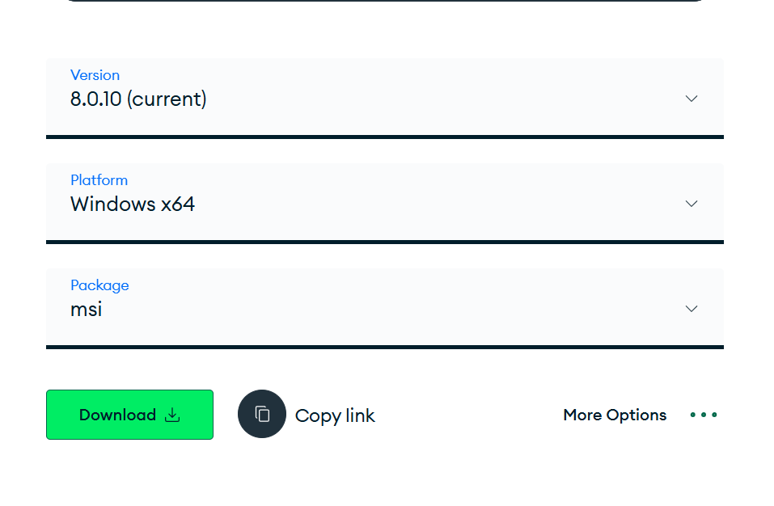

2. **Installation :**  
   Installez MongoDB sur votre machine :

   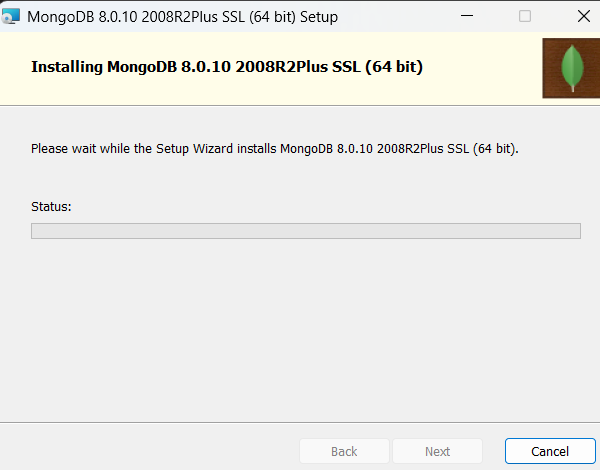

3. **MongoDB Compass :**  
   Ce processus installe également MongoDB Compass, une interface graphique qui vous permettra de mieux visualiser et interagir avec vos bases de données :

   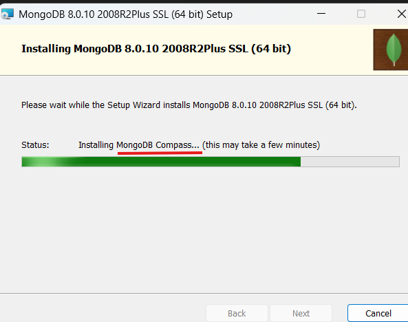
   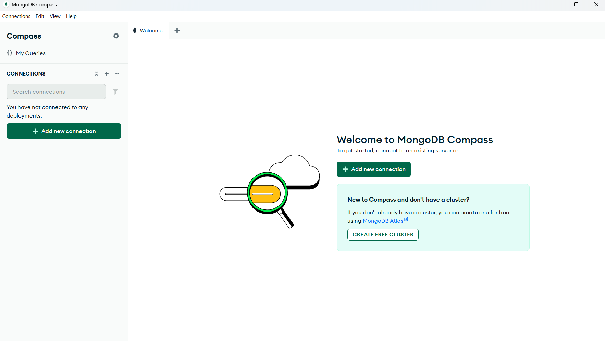

### Configuration de la connexion

Une fois l'installation terminée, suivez ces étapes :

1. **Ajout d'une connexion :**  
   Après l'installation, ajoutez une nouvelle connexion :

   

2. **Paramètres par défaut :**  
   Conservez les paramètres par défaut, car aucun ajustement n'est nécessaire à ce stade :

   

3. **Vérification :**  
   La connexion finalisée s'affiche comme suit :

   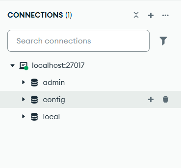

### Lancement du shell Mongosh

On va maintenant pouvoir lancer le shell soit dans un cmd en ecrivant

```bash
mongosh
```

soit sur Compass juste ici :
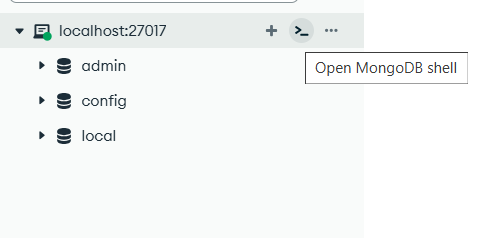

On va se placer dans la base admin :

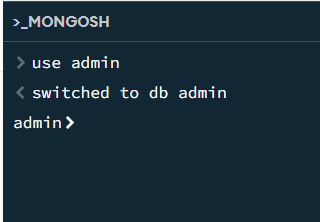

### Creation de l'utilisateur

Puis créer un nouvel utilisateur que l'on appelera "Matthis" avec comme mot de passe "MotDePasseIndechiffrable".

On lui attribue ensuite le rôle readWrite sur la base testdb que l'on va créer juste après

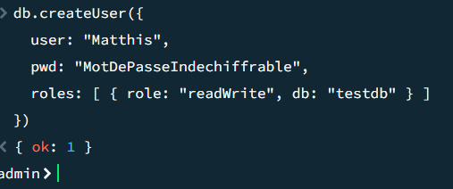

### Création de la base testdb et insertion de documents

Maintenant pour créer la base, on va d'abord se déplacer dedans (même si elle n'existe pas)

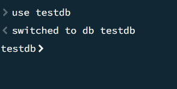

puis on va insérer dans une collection nommée employes, un employé nommé kevin malone, et on a maintenant la base qui s'est créée:

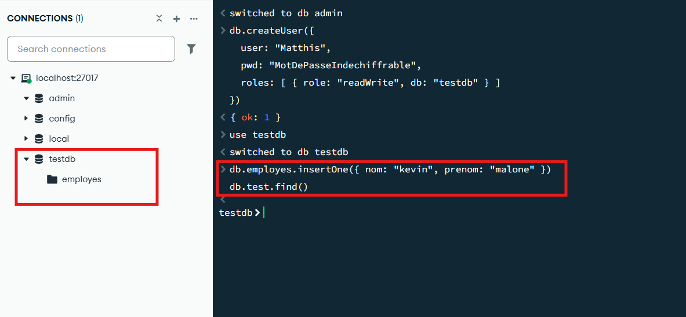

On va rajouter quelques autres employés :
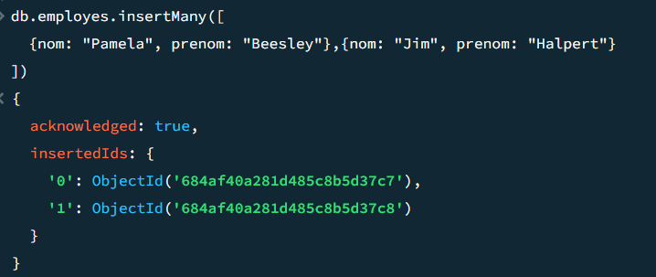

Et maintenant si on va voir dans la collection :

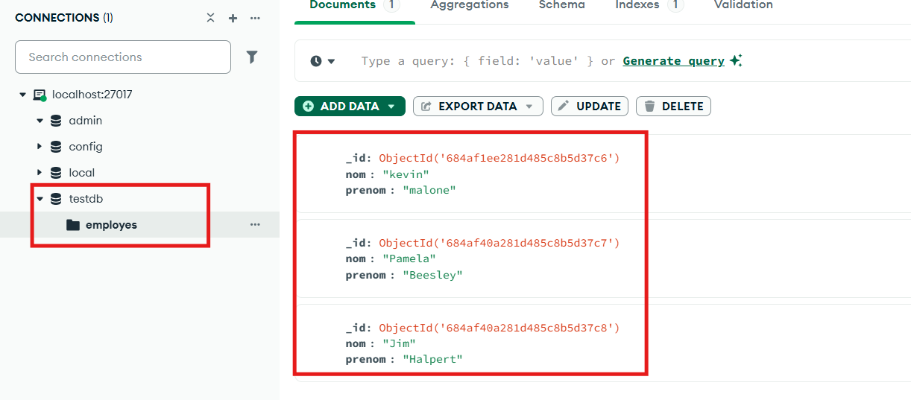

On a bien nos 3 documents employés

## Replica Set

### Preambule

Pour les replicaSet, on va avoir besoin de mongod accessible dans les variables d'environnement pour pouvoir l'appeler en cmd :
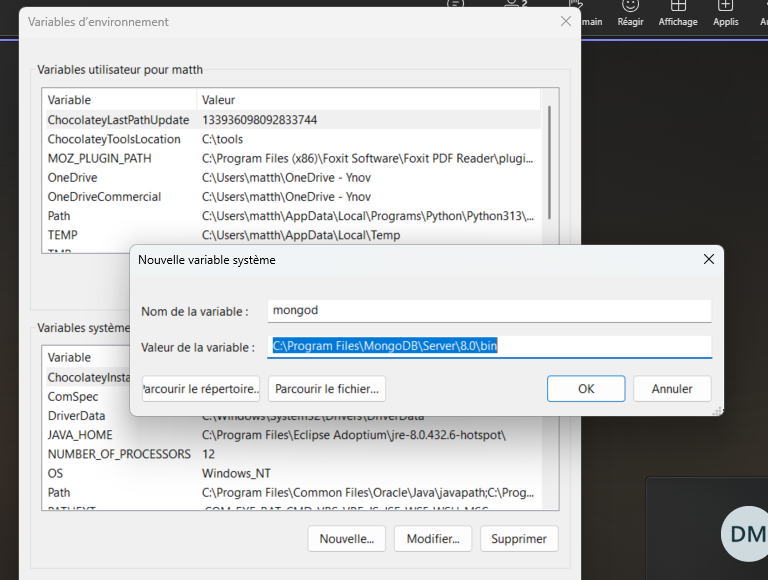

En suite dans le dossier replicaset on creé 3 dossier, un par instance : data1 data2 et data3

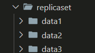

### Deploiement des Replica

On va ensuite ouvrir 3 terminal et se placer dans replicaset
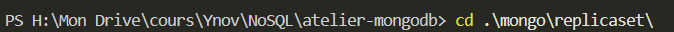

Puis dans chaque terminal, on va deployer une instance avec les commande suivante :

```
mongod --replSet rs0 --port 27018 --dbpath ./data1 --bind_ip localhost --logpath ./data1/mongod.log --logappend

mongod --replSet rs0 --port 27019 --dbpath ./data2 --bind_ip localhost --logpath ./data2/mongod.log --logappend

mongod --replSet rs0 --port 27020 --dbpath ./data3 --bind_ip localhost --logpath ./data3/mongod.log --logappend
```

Ces commandes vont créer et executer nos replicats :

- la premiere dans data1 sur le port 27018
- la seconde dans data2 sur le port 27019
- la derniere dans data3 sur le port 27020

### initialisation du replicaset

On va se connecter a la premiere instance : celle en 27018 (mongosh --port 27018), et executer cette commande qui audra pour effet de definir nos 3 instances dans le replicaSet rs0 (je l'avais deja fait une fois mais j'ai perdu le screen c'est pour ça qu'il y a marqué already initialized):

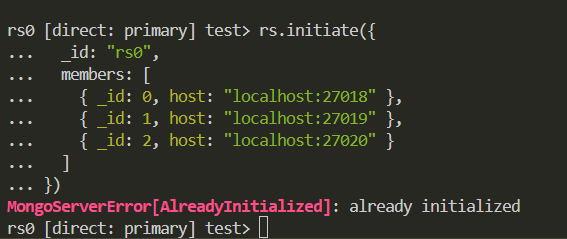

maintenant verfions chaque instance :

- 27018 : 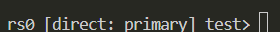

- 27019 : 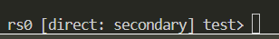

- 27020 : 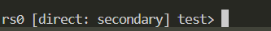

### insertion sur le primary

On va maintenant se connecter sur le primary et y rajouter un nouvel employé et voir si cela se repercute sur nos secondary

Sur 27018 (primary) :
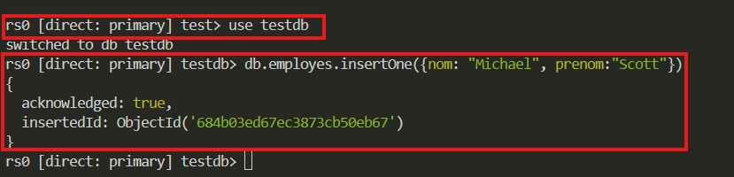

maintenant on va se rendre sur 27019 et 27020 et faire un

```
db.employes.find()
```

pour récupérer notre employé :

Sur l'instance 27019 :

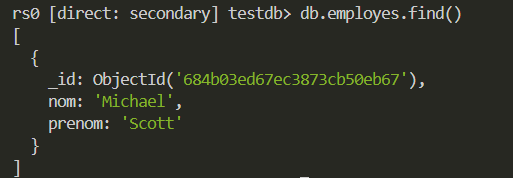

et sur 27020 :

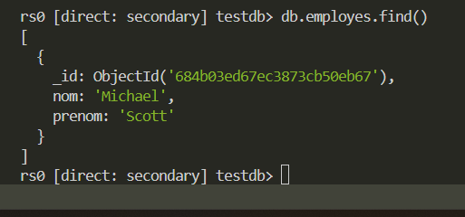

On peut donc en conclure que la réplication a marché.

## Integration

Nous avons créer un script python simple utilisant la librairie pymongo et  qui va se connecter a la base standalone avec le compte admin créer précédemment(27017), puis qui va dans un premier temps :

Insertion :
Le script insère un document "comptabilité" dans une nouvelle collection "services"

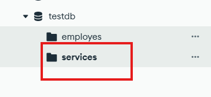


Lecture :
Il recherche et affiche ensuite les documents ayant le champ name égal à "Comptabilité" afin de confirmer que l'insertion a bien eu lieu.

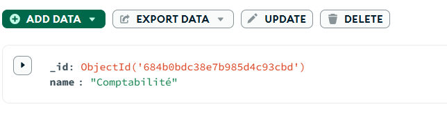

Mise à jour :
Le document est modifié : la valeur du champ name passe de "Comptabilité" à "IT".

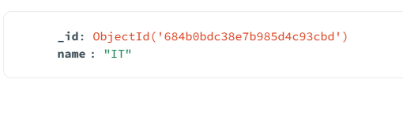

Suppression :
Enfin, le document mis à jour (celui avec name égal à "IT") est supprimé, permettant ainsi de nettoyer la collection.

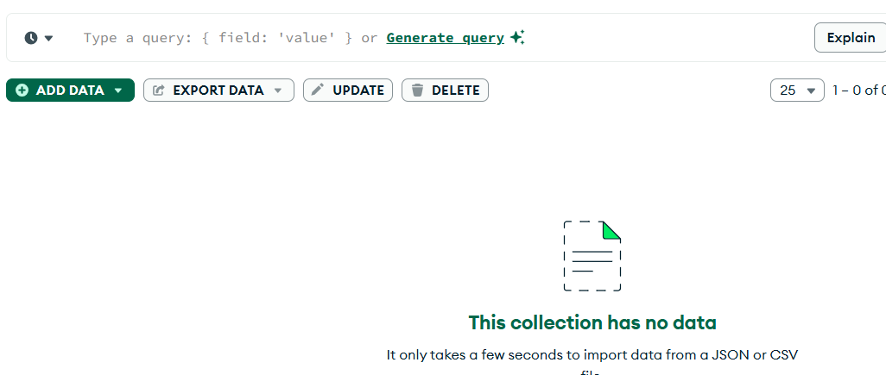


